### ML.NET &  Model Builder and (Bonus Track) ASP.NET App to consume the model. Enjoy it! 🤟  
 
+ Create a App Console and add ML.NET from NugetPackage. I installed 1.7.0-preview.final (I love use and test previews versions 😁)  
 

+ Create ML.NET context. MlContext is the staring point for all ML.NET operations. The MLContext is used for all aspects of creating and consuming an ML.NET model. 
+ Load Data: Machine learning uses known data (for example, training data) to find patterns in order to make predictions on new, unknown data.
The inputs for machine learning are called Features, which are the attributes used to make predictions. The output of machine learning is called the Label, which is the actual prediction. 
Data in ML.NET is represented as an IDataView, which is a flexible, efficient way of describing tabular data (for example, rows and columns). IDataView objects can contain numbers, text, booleans, vectors, and more. You can load data from files or from real-time streaming sources to an IDataView.
LoadFromTextFile allows you to load data from TXT, CSV, TSV, and other file formats. 
### Use the "DataSTEMSalary.csv" file for load data 
Tip: LoadFromEnumerable enables loading from in-memory collections, JSON/XML, relational and non-relational databases (for example, SQL, CosmosDB, MongoDB), and many other data sources. Link for more information: https://docs.microsoft.com/en-us/dotnet/machine-learning/how-to-guides/load-data-ml-net?WT.mc_id=dotnet-35129-website   
  
+ Transform data: In most cases, the data that you have available isn't suitable to be used directly to train a machine learning model. The raw data needs to be pre-processed using data transformations. 
+ Choose algorithm: When using machine learning and ML.NET, you must choose a machine learning task that goes along with your scenario. ML.NET offers over 30 algorithms (or trainers) for a variety of ML tasks:
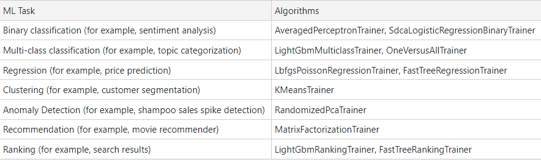  
I used LbfgsPoissonRegression.  
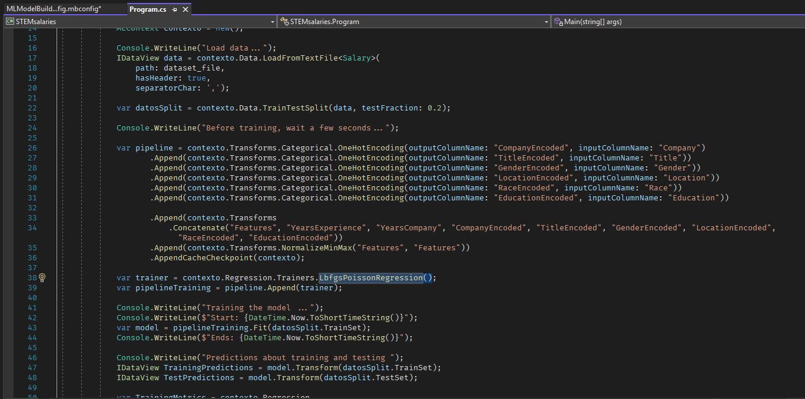  
+ Train model: The data transformations and algorithms you have specified are not executed until you call the Fit() method (because of ML.NET's lazy loading approach). This is when model training happens.  
An estimator takes in data, learns from the data, and creates a transformer. In the case of model training, the training data is the input, and the trained model is the output; the trained model is thus a transformer that turns the input Features from new data into output predictions. 
Link for more information aboul model training: https://docs.microsoft.com/en-us/dotnet/machine-learning/how-to-guides/train-machine-learning-model-ml-net?WT.mc_id=dotnet-35129-website   

+ Evaluate model: ML.NET offers evaluators that assess the performance of your model on a variety of metrics. Link evaluation metrics: https://docs.microsoft.com/en-us/dotnet/machine-learning/resources/metrics?WT.mc_id=dotnet-35129-website  
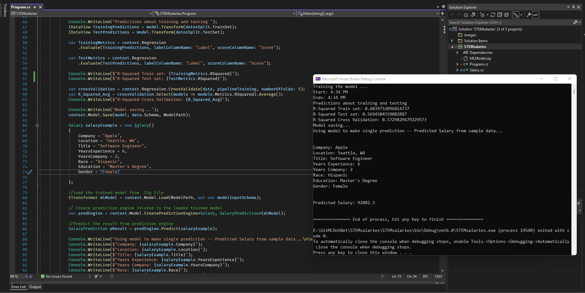  
-------------------------------------------------------------------------------------------------------------------------------------------------------------------------
### Use the same example with ML.NET Model Builder 💪 
ML.NET Model Builder is an intuitive graphical Visual Studio extension to build, train, and deploy custom machine learning models.
Model Builder uses automated machine learning (AutoML) to explore different machine learning algorithms and settings to help you find the one that best suits your scenario.  
How to install ML.NET Model Builder Link: https://docs.microsoft.com/en-us/dotnet/machine-learning/how-to-guides/install-model-builder?tabs=visual-studio-2022     
+ Create a App Console and add ML.NET from NugetPackage. I installed 1.7.0-preview.final.    
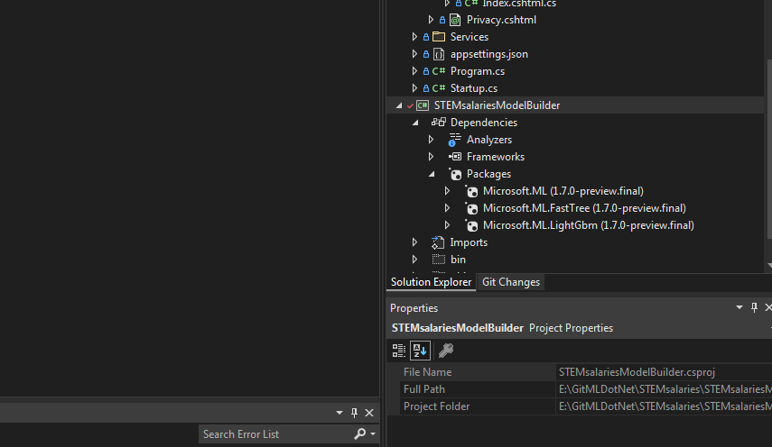  
+ Select Value prediction Scenario.   
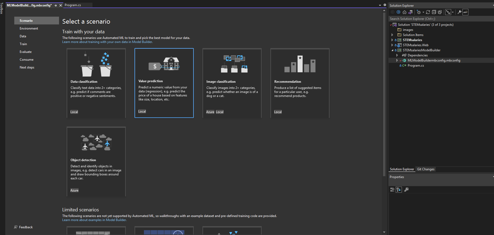  
+ Select Trainning Environment.   
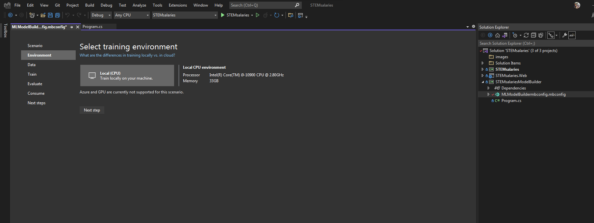  
+ Once you have chosen your scenario, Model Builder asks you to provide a dataset.  
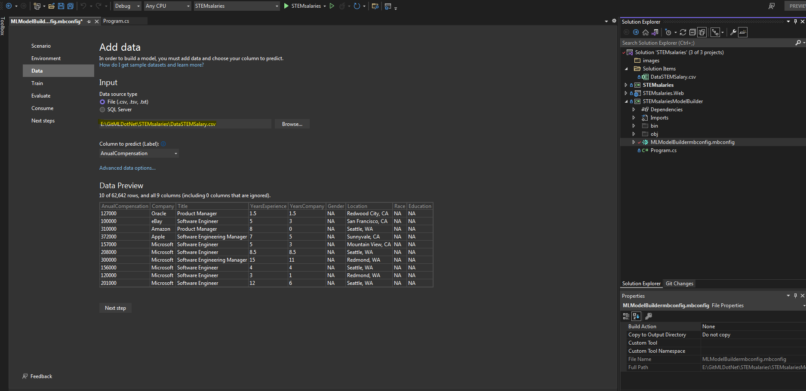  
+ Click the Advanced data options link and check the categorical columns.   
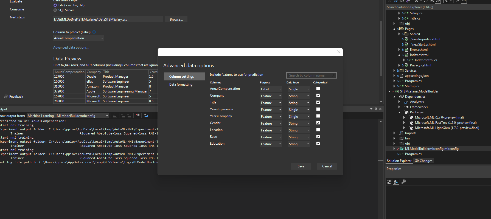  
+ Train: The machine learning task used to train the annual salary prediction model in this tutorial is regression. 
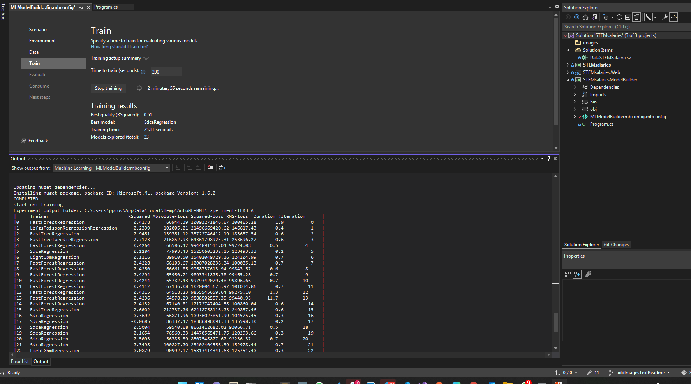  
During the model training process, Model Builder trains separate models using different regression algorithms and settings to find the best-performing model for your dataset.  
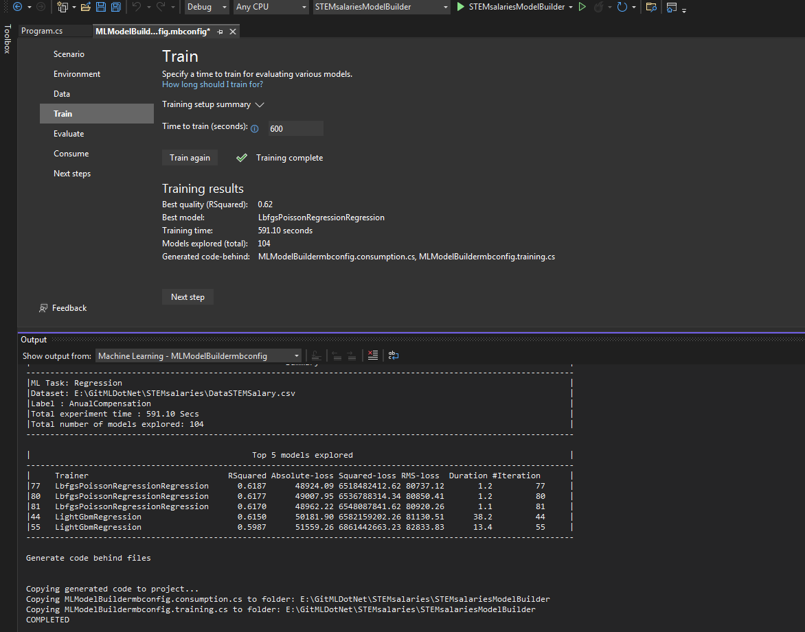  
+ Evaluate: The result of the training step will be one model which had the best performance. The evaluation step of the Model Builder tool, in the Best model section, will contain the algorithm used by the best performing model in the Model entry along with metrics for that model in RSquared.   
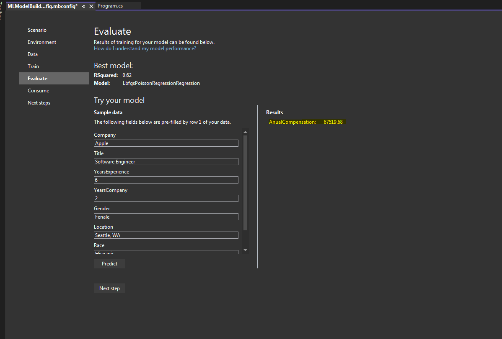  
-------------------------------------------------------------------------------------------------------------------------------------------------------------------------
### Bonus Track!!! I share a web application in NET Core 3.1 using these models to predict the annual salary. 😊 
I was training with a little more time with model builder and then exported the model to use it in my ASP.NET application. 
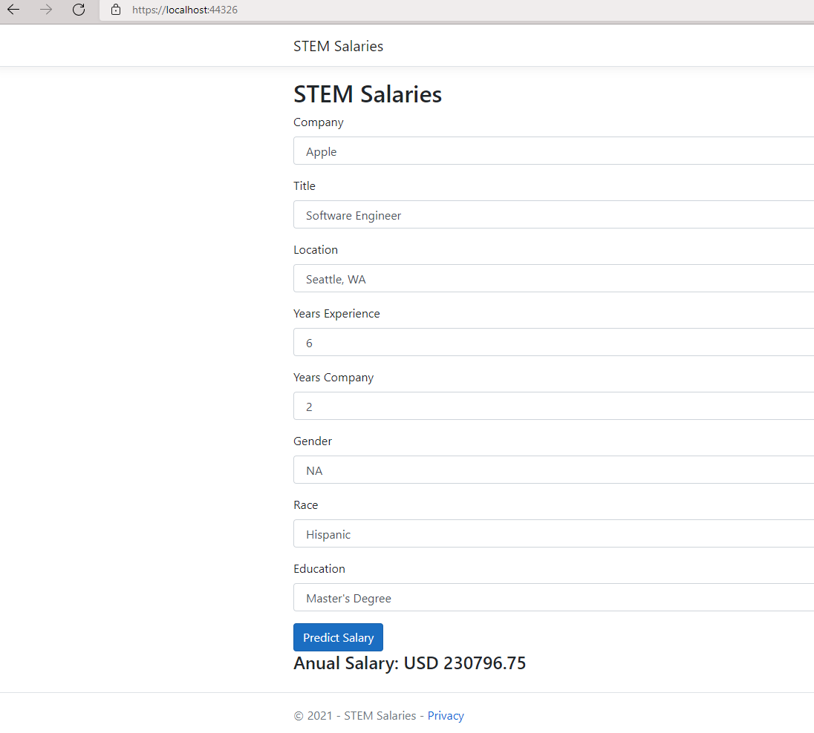  

### Keep creating and training models with ML.NET.  
### Happy Coding !!! 

-------------------------------------------------------------------------------------------------------------------------------------------------------------------------
### DataSet: https://www.kaggle.com/jackogozaly/data-science-and-stem-salaries

## ML.NET Documentation
>https://docs.microsoft.com/en-us/dotnet/machine-learning/ 
>https://dotnet.microsoft.com/learn/ml-dotnet/what-is-mldotnet 
>https://dotnet.microsoft.com/apps/machinelearning-ai/ml-dotnet/model-builder

