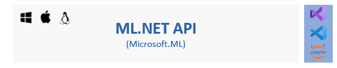
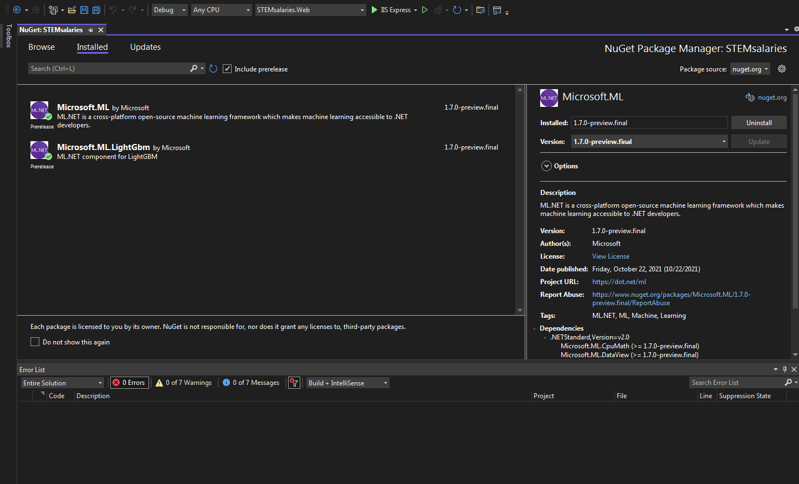
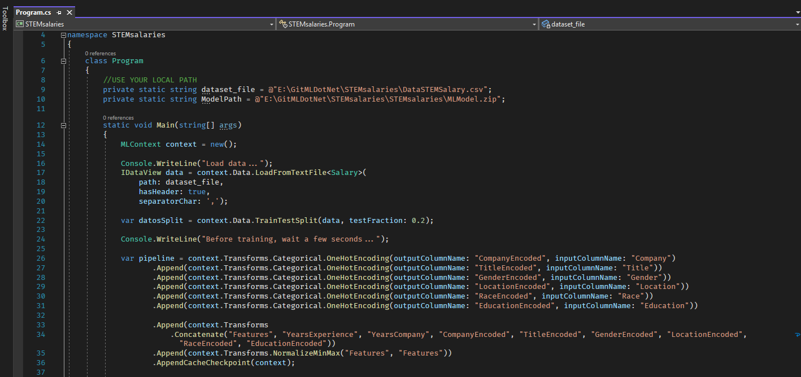

### ML.NET &  Model Builder and (Bonus Track) ASP.NET App to consume the model. Enjoy it!  
 
+ Create a App Console and add ML.NET from NugetPackage. I installed 1.7.0-preview.final (I love test previews versions 😁)
 

+ Create ML.NET context. MlContext is the staring point for all ML.NET operations. The MLContext is used for all aspects of creating and consuming an ML.NET model. 
Machine learning uses known data (for example, training data) to find patterns in order to make predictions on new, unknown data.
The inputs for machine learning are called Features, which are the attributes used to make predictions. The output of machine learning is called the Label, which is the actual prediction. 
Data in ML.NET is represented as an IDataView, which is a flexible, efficient way of describing tabular data (for example, rows and columns). IDataView objects can contain numbers, text, booleans, vectors, and more. You can load data from files or from real-time streaming sources to an IDataView.
LoadFromTextFile allows you to load data from TXT, CSV, TSV, and other file formats.
 

### DataSet: https://www.kaggle.com/muhammadshahzadkhan/dogvscat

# ML.NET Documentation
>https://docs.microsoft.com/en-us/dotnet/machine-learning/ 
>https://dotnet.microsoft.com/apps/machinelearning-ai/ml-dotnet/model-builder
